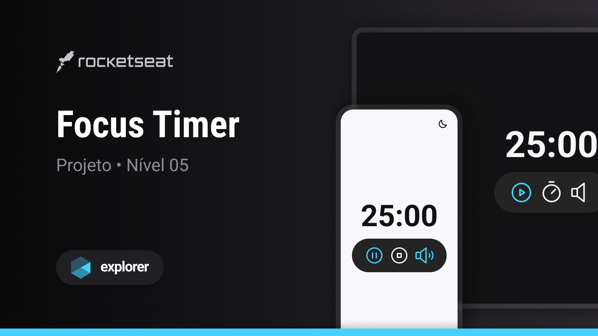
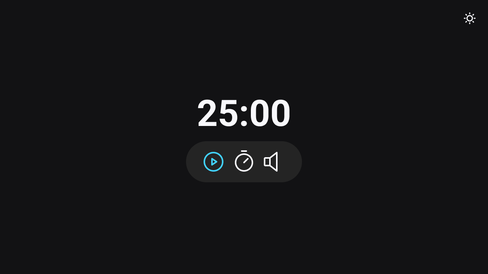
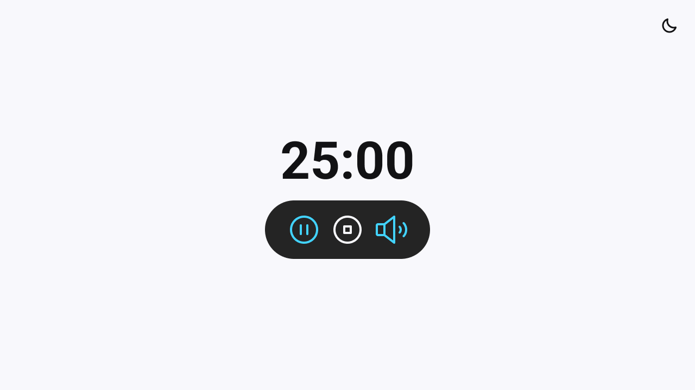

  

   
   

  

    <a href="#-projeto">Projeto</a>&nbsp;&nbsp;&nbsp;|&nbsp;&nbsp;&nbsp;
    <a href="#-tecnologias">Tecnologias</a>&nbsp;&nbsp;&nbsp;|&nbsp;&nbsp;&nbsp;
    <a href="#-layout">Layout</a>&nbsp;&nbsp;&nbsp;|&nbsp;&nbsp;&nbsp;
    <a href="#-contato">Contato</a>
  

  
  

## Sobre o projeto

Este projeto consiste em uma interface web simples, construída como parte da trilha Explorer oferecida pela Rocketseat. O FocusTimer Pomodoro auxilia no trabalho em intervalos de tempo que o usuário decidir.

Funcionalidades:
* Play: iniciar contador
* Pause: pausar contador
* Set: ajustar contador
* Reset: reniciar contador
* Music-on: iniciar música
* Music-off: pausar música 

## Tecnologias
- HTML
- CSS
- JavaScript
- Figma

## Layout do projeto
<table>
  <tr>
    <td></td>
    <td></td>
  </tr> 
</table>

## Demonstração
Aqui está uma prévia do resultado final do projeto desenvolvido
[Link Demonstração](https://joao-sillva.github.io/FocusTimer/)

## Desafio
A partir deste projeto, foi proposto um desafio de criar uma versão 2.0 do FocusTimer Pomodoro. Você pode encontrar mais detalhes do desafio clicando 
[FocusTimer-v2](https://github.com/joao-sillva/FocusTimer-v2).

## Contato
Se você tiver alguma dúvida ou quiser entrar em contato, você pode me enviar uma mensagem pelo
[LinkedIn](https://www.linkedin.com/in/joao-sillva/).

(<a href="#readme-top">voltar ao topo</a>)
